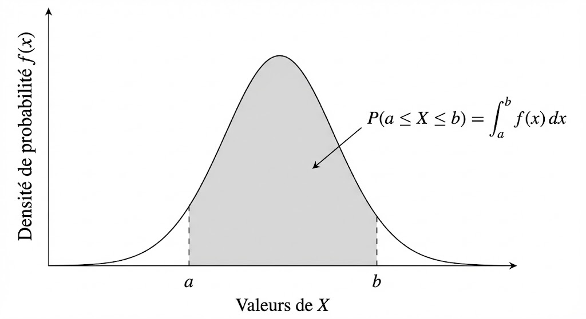
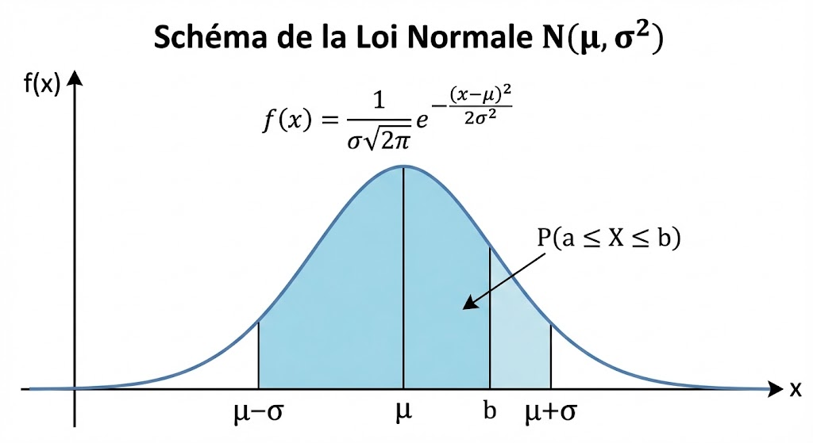

# Variables Aléatoires Continues

---

## 📊 Définition

Une **variable aléatoire continue** $X$ est une fonction qui associe à chaque issue d'une expérience aléatoire un nombre réel :

$$
X : \Omega \rightarrow \mathbb{R}
$$

**Caractéristique principale :** Contrairement au cas discret, $X$ peut prendre une **infinité de valeurs** dans un intervalle de $\mathbb{R}$ (par exemple $[a,b]$ ou $\mathbb{R}$ tout entier).

### Exemple concret

Soit $X$ la taille d'une personne choisie au hasard. Cette variable peut prendre n'importe quelle valeur dans un intervalle continu (par exemple entre 1,50 m et 2,00 m).

---

## 🔄 Comparaison : Cas discret vs Cas continu

### Variables aléatoires discrètes

Pour une **variable aléatoire discrète** (exemples : nombre de succès, nombre de défauts, résultat d'un lancer de dé), la loi de probabilité est donnée par des **masses ponctuelles**.

Chaque valeur entière $k$ possède une probabilité associée :

$$
p(k) = P(X = k)
$$

Connaître les valeurs $P(X = k)$ pour chaque $k$ **décrit complètement la loi**.

Pour tout intervalle $[a,b]$ :

$$
P(a \le X \le b) = \sum_{k=a}^{b} p(k)
$$

### Variables aléatoires continues

À l'inverse, pour une **variable aléatoire continue** (exemples : taille, durée, poids), on **ne peut plus parler de probabilité ponctuelle** :

$$
P(X = x) = 0 \quad \text{pour tout } x \in \mathbb{R}
$$

On utilise alors une **fonction de densité** $f(x)$, telle que la probabilité qu'une valeur appartienne à un **intervalle** correspond à **l'aire sous la courbe** de cette fonction.

> **⚠️ Remarque importante :** $f(x)$ n'est **pas** une probabilité, c'est une **densité de probabilité**.

---

## ❓ Problématique

La description d'une loi continue diffère fondamentalement de celle d'une loi discrète :

### Probabilité ponctuelle nulle

Une variable aléatoire continue $X$ a **une probabilité nulle de prendre une valeur exactement déterminée** :

$$
P(X = x) = 0 \quad \text{pour tout } x \in \mathbb{R}
$$

**Pourquoi ?** Il existe une infinité de valeurs possibles dans un intervalle de $\mathbb{R}$, donc le « poids » d'une valeur précise est infinitésimal (nul).

### Exemple illustratif

Si $X$ désigne la taille d'un individu :

$$
P\bigl(X = 1{,}824902139821398\ldots\bigr) = 0
$$

### Conséquence

Il n'est donc **pas possible de définir la loi de $X$ à partir des probabilités ponctuelles**, comme dans le cas discret.

En revanche, on peut décrire la loi d'une variable continue grâce à la **fonction de répartition** et à la **fonction de densité**.

---

## 📈 Fonction de répartition

### Définition

La **fonction de répartition** $F$ est définie par :

$$
F(x) = P(X \le x) \quad \text{pour tout } x \in \mathbb{R}
$$

Elle permet de calculer les probabilités que $X$ prenne ses valeurs dans une partie de $\mathbb{R}$.

### Interprétation

**$F(x) = P(X \le x)$ est la passerelle** entre la densité de probabilité et les probabilités d'intervalles.

---

## 📐 Loi de probabilité d'une variable continue

### Relation entre densité et répartition

La loi de probabilité de $X$ est définie par une **fonction de répartition** $F$, elle-même décrite par une **fonction de densité de probabilité** $f$, telle que :

$$
F(t) = \int_{-\infty}^{t} f(x) \, \mathrm{d}x
$$

où :

$$
f : \mathbb{R} \rightarrow [0, +\infty[
$$

### Probabilité d'un intervalle

De ce fait, pour tout intervalle $[a,b]$ :

$$
P(a \le X \le b) = \int_a^b f(x) \, \mathrm{d}x
$$

La probabilité que $X$ se trouve dans un intervalle $[a,b]$ apparaît alors comme **l'aire sous la courbe** de la densité $f$ entre $a$ et $b$, au-dessus de l'axe des abscisses.

### Illustration graphique

_Figure : Illustration de la probabilité comme aire sous la courbe de densité entre $a$ et $b$._

---

## ✅ Propriétés

### Propriétés de la fonction de répartition $F$

1. $F$ est une fonction **continue** (par morceaux) et **croissante**
2. Limites aux bornes :
   $$
   \lim_{x \to -\infty} F(x) = 0 \quad \text{et} \quad \lim_{x \to +\infty} F(x) = 1
   $$

### Propriétés de la fonction de densité $f$

1. **Probabilité d'un intervalle :** Pour tout intervalle $[a,b]$, la probabilité que $X$ prenne une valeur dans $[a,b]$ est donnée par :

   $$
   P(a \le X \le b) = \int_a^b f(x) \, \mathrm{d}x
   $$

2. **Normalisation :** La densité $f$ vérifie :
   $$
   \int_{-\infty}^{+\infty} f(x) \, \mathrm{d}x = 1
   $$

---

## 📊 Espérance et variance

### Définition

Soit $X$ une variable aléatoire continue de $\Omega$ dans $\mathbb{R}$ de densité $f$. On calcule l'espérance et la variance à l'aide des formules suivantes :

### Espérance mathématique

L'**espérance** (ou moyenne) de $X$ est définie par :

$$
E(X) = \int_{-\infty}^{+\infty} x \cdot f(x) \, \mathrm{d}x
$$

### Variance

La **variance** de $X$ mesure la dispersion autour de l'espérance :

$$
V(X) = E\bigl[(X - E(X))^2\bigr] = \int_{-\infty}^{+\infty} (x - E(X))^2 \cdot f(x) \, \mathrm{d}x
$$

**Formule alternative (souvent plus pratique pour les calculs) :**

$$
V(X) = E(X^2) - [E(X)]^2
$$

---

## 🎲 Lois usuelles

### 3.1 Loi uniforme

Cette loi modélise un phénomène **uniforme** sur un intervalle donné.

#### Définition

La variable aléatoire $X$ suit une **loi uniforme** sur l'intervalle borné $[a,b]$ si elle a une densité **constante** sur cet intervalle et **nulle** en dehors de l'intervalle.

**Notation :** $X \sim \mathcal{U}(a,b)$

Cette loi est l'équivalent continu de la loi uniforme discrète.

#### Fonction de densité

$$
f(x) = \begin{cases}
\dfrac{1}{b-a} & \text{si } x \in [a,b] \\[0.5em]
0 & \text{sinon}
\end{cases}
$$

#### Espérance et variance

- **Espérance :**

  $$
  E(X) = \frac{a+b}{2}
  $$

- **Variance :**
  $$
  V(X) = \frac{(b-a)^2}{12}
  $$

---

### 3.2 Loi exponentielle

#### Définition

Soit $\lambda$ un réel strictement positif. La variable aléatoire $X$ suit une **loi exponentielle** de paramètre $\lambda$, notée $\mathcal{E}(\lambda)$, si elle admet pour densité :

$$
f(x) = \begin{cases}
\lambda \cdot e^{-\lambda x} & \text{si } x \in [0, +\infty[ \\[0.5em]
0 & \text{sinon}
\end{cases}
$$

#### Espérance et variance

- **Espérance :**

  $$
  E(X) = \frac{1}{\lambda}
  $$

- **Variance :**
  $$
  V(X) = \frac{1}{\lambda^2}
  $$

#### Illustration graphique

_Figure : Illustration de la fonction de densité de la loi exponentielle._

#### Applications

Les lois exponentielles sont souvent utilisées pour modéliser des **temps d'attente** ou des **durées de vie**. Exemples :

- Temps d'attente jusqu'au prochain tremblement de terre
- Durée de vie avant la prochaine panne d'un appareil
- Temps avant la prochaine désintégration d'un noyau radioactif
- Intervalle de temps entre deux événements dans un processus de Poisson

---

### 3.3 Loi normale ou Gaussienne

La loi normale est le modèle naturel pour les **erreurs de mesure** et les phénomènes avec beaucoup de petites causes indépendantes.

#### Définition

On dit que $X$ suit une **loi normale** (ou **loi gaussienne**) de paramètres $\mu$ (moyenne) et $\sigma^2$ (variance), notée $X \sim \mathcal{N}(\mu, \sigma^2)$, si sa densité est :

$$
f(x) = \frac{1}{\sigma \sqrt{2\pi}} \cdot e^{-\frac{(x-\mu)^2}{2\sigma^2}}
$$

> **📝 Remarque :** Certains auteurs utilisent la notation $N(\mu, \sigma^2)$ au lieu de $\mathcal{N}(\mu, \sigma^2)$.

#### Illustration graphique

_Figure : Illustration de la fonction de densité de la loi normale._

#### Espérance et variance

- **Espérance :**

  $$
  E(X) = \mu
  $$

- **Variance :**
  $$
  V(X) = \sigma^2
  $$

#### Concentration autour de la moyenne

**Règle 68-95-99,7** (repères rapides) :

La loi normale présente une propriété remarquable de **concentration des valeurs autour de la moyenne** $\mu$. Cette concentration peut être quantifiée précisément à l'aide de l'écart-type $\sigma$ :

- **Intervalle à 1 écart-type :** Dans l'intervalle $[\mu - \sigma, \mu + \sigma]$, de **longueur $2\sigma$** et **centré autour de la moyenne** $\mu$, on peut observer environ **68%** des individus lorsque la variable aléatoire suit une loi normale.

- **Intervalle à 2 écarts-types :** Dans l'intervalle $[\mu - 2\sigma, \mu + 2\sigma]$, de **longueur $4\sigma$** et **centré autour de la moyenne** $\mu$, on peut observer environ **95%** des individus lorsque la variable aléatoire suit une loi normale.

- **Intervalle à 3 écarts-types :** Dans l'intervalle $[\mu - 3\sigma, \mu + 3\sigma]$, de **longueur $6\sigma$** et **centré autour de la moyenne** $\mu$, on peut observer environ **99,7%** des individus lorsque la variable aléatoire suit une loi normale.

> **💡 Interprétation pratique :** Ces intervalles permettent de comprendre la dispersion des données. Par exemple, si $\mu = 170$ cm et $\sigma = 10$ cm pour la taille d'une population :
>
> - 68% des individus mesurent entre 160 cm et 180 cm (intervalle $[170-10, 170+10]$)
> - 95% des individus mesurent entre 150 cm et 190 cm (intervalle $[170-20, 170+20]$)
> - 99,7% des individus mesurent entre 140 cm et 200 cm (intervalle $[170-30, 170+30]$)

> **⚠️ Condition d'application :** Cette règle ne s'applique que lorsque la distribution des données suit effectivement une **loi normale**. Pour d'autres distributions (asymétriques, multimodales, etc.), ces pourcentages ne sont pas valables.

---
